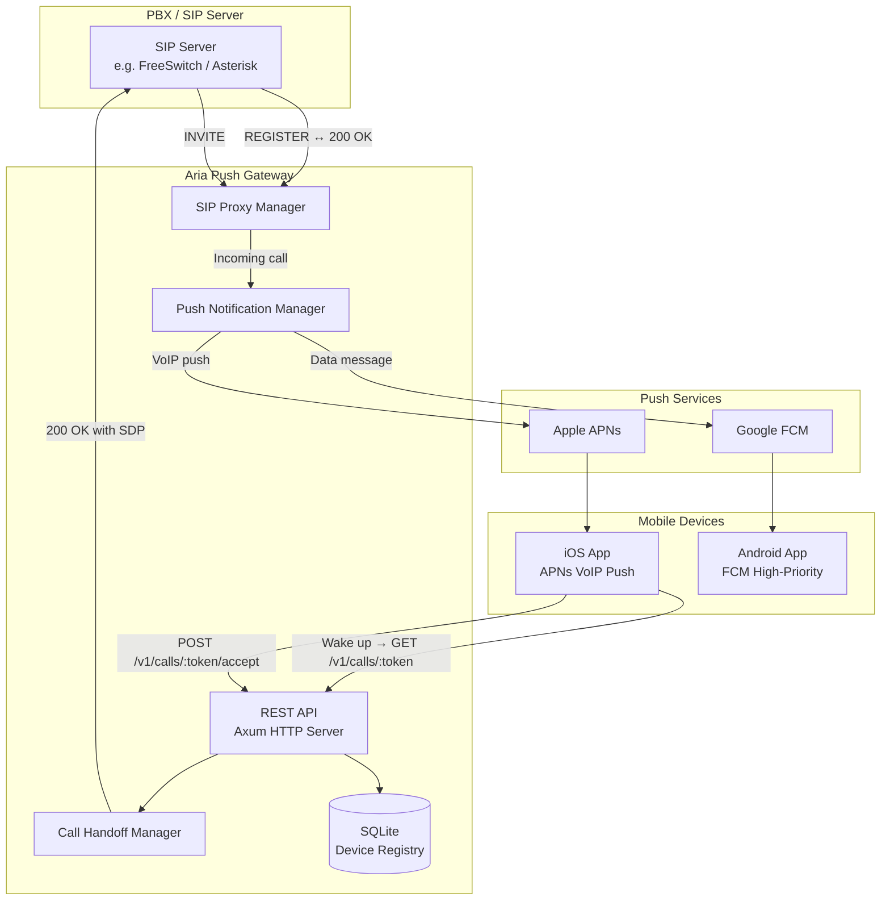
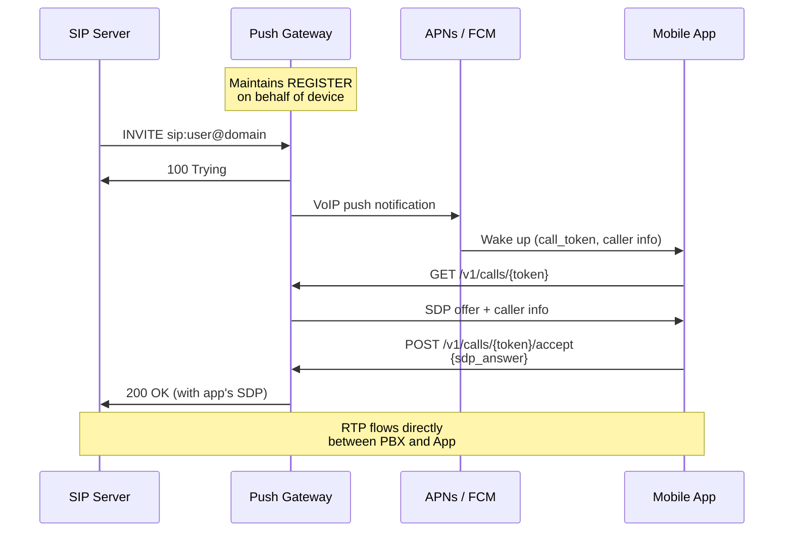

# Aria Push Gateway

SIP push gateway for Aria mobile clients. Maintains SIP registrations on behalf of mobile devices, intercepts incoming calls, and delivers VoIP push notifications via APNs (iOS) and FCM (Android).

## Architecture



## Call Flow



## Quick Start

### 1. Build

```bash
cargo build --release
```

The binary is at `target/release/aria-gateway`.

### 2. Configure

```bash
cp gateway.example.toml gateway.toml
# Edit gateway.toml — set auth.secret, push provider credentials, etc.
```

### 3. Run

```bash
./target/release/aria-gateway --config gateway.toml
```

The gateway starts on `0.0.0.0:8080` by default. Override with `--listen`:

```bash
./target/release/aria-gateway --listen 0.0.0.0:443
```

## Docker

Build from the `5060/` parent directory (the gateway depends on the sibling `aria-sip-core` crate):

```bash
cd /path/to/5060
docker build -f push-gateway/Dockerfile -t aria-gateway .
```

Run:

```bash
docker run -d \
  -p 8080:8080 \
  -v /path/to/data:/data \
  --name aria-gateway \
  aria-gateway
```

Mount your `gateway.toml`, APNs `.p8` key, and FCM service account JSON into `/data`.

## API Reference

All authenticated endpoints require `Authorization: Bearer <token>`.

### Auth

| Method | Path | Description |
|--------|------|-------------|
| `POST` | `/v1/auth/token` | Create a JWT token |

**Body:** `{"user_id": "alice@example.com", "api_key": "<secret>"}`

### Devices

| Method | Path | Description |
|--------|------|-------------|
| `POST` | `/v1/devices` | Register a device for push |
| `GET` | `/v1/devices/{id}` | Get device + SIP registration status |
| `DELETE` | `/v1/devices/{id}` | Unregister device |

**Register body:**
```json
{
  "platform": "ios",
  "push_token": "<apns-device-token>",
  "bundle_id": "com.example.aria",
  "sip_username": "alice",
  "sip_password": "secret",
  "sip_domain": "sip.example.com",
  "sip_registrar": "pbx.example.com",
  "sip_transport": "udp",
  "sip_port": 5060,
  "sip_display_name": "Alice"
}
```

### Call Signaling

| Method | Path | Description |
|--------|------|-------------|
| `POST` | `/v1/calls` | Initiate outgoing call (gateway sends INVITE) |
| `GET` | `/v1/calls/{token}` | Get incoming call offer (SDP + caller info) |
| `POST` | `/v1/calls/{token}/accept` | Accept call with SDP answer |
| `POST` | `/v1/calls/{token}/reject` | Reject call (sends 603 to PBX) |
| `POST` | `/v1/calls/{token}/hangup` | Hang up active call (sends BYE to PBX) |

**Outgoing call body:**
```json
{
  "destination_uri": "sip:bob@example.com",
  "sdp_offer": "<SDP>",
  "sip_username": "alice",
  "sip_password": "secret",
  "sip_domain": "sip.example.com",
  "sip_display_name": "Alice"
}
```

**Response:** `{"call_token": "<token>", "sdp_answer": "<SDP>"}`

**Accept body:** `{"sdp_answer": "<SDP>"}`

### Health

| Method | Path | Description |
|--------|------|-------------|
| `GET` | `/health` | Health check (returns `ok`) |

## Self-Hosting

The gateway is designed to be self-hosted. Requirements:

- **Network:** The gateway needs UDP connectivity to your SIP server for REGISTER/INVITE traffic. It also needs outbound HTTPS to APNs/FCM.
- **Database:** Uses SQLite (no external database needed). The file is created automatically.
- **Push credentials:** You need an APNs auth key (`.p8` file) for iOS and/or a Firebase service account JSON for Android.
- **TLS:** Put the gateway behind a reverse proxy (nginx, Caddy, Traefik) for HTTPS termination. The mobile app connects over HTTPS.
- **DNS:** Point a subdomain (e.g., `gateway.example.com`) at your server.

### Minimum system requirements

- 1 vCPU, 256 MB RAM (handles hundreds of concurrent registrations)
- ~10 MB disk for the binary + database
- Linux, macOS, or any platform Rust targets

## Shared Code

This gateway uses `aria-sip-core` for SIP digest authentication and message parsing — the same crate used by the Aria desktop softphone. This ensures protocol compatibility across all Aria clients.

## License

Proprietary — 5060 Solutions
